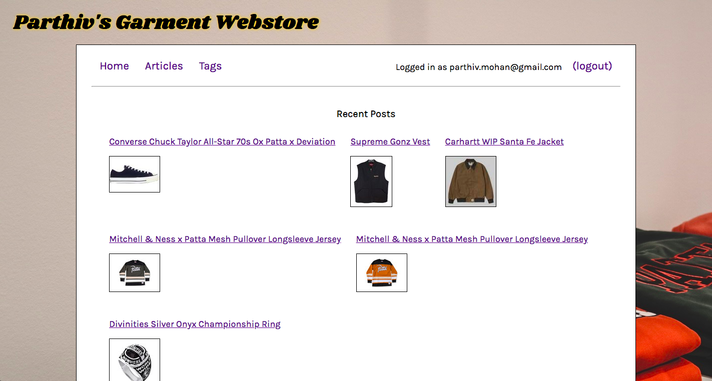

# Webstore

Click on the image above to visit the site.

## Summary

A webstore to list clothing for sale.

## Functionality

The site admin can add items to the webstore. The type of clothing is specified upon creation and then items are automatically listed under the correct tab. A Paypal transaction is linked.

## Further Steps

Paypal integration should use API response. Item categories should be in dropdown in creation form. Inventory tracking.

